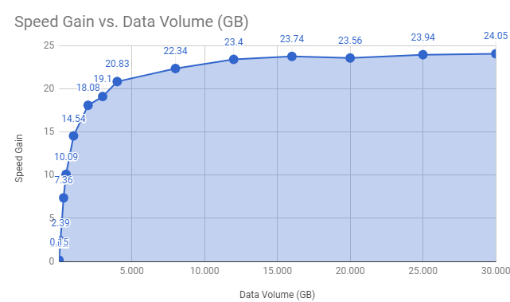

# GZIP Accelerator

The GZIP accelerator provides an hardware-accelerated gzip compression.
It is up to 25X faster than CPU compression.



*This figure is provided as an example, please note that compression speed is somewhat dependent on the file content.*

## Features

- Hardware-accelerated GZIP compression
- Remote or local execution facility
- Easy to use Python API

## Limitations

- The GZIP accelerator does not support password-protected archive generation.
- Inputs and outputs can't be larger than 30GB.
- See also limitations from API

## Parameters

This section describes accelerator inputs and outputs.

### Configuration parameters
No parameters required.

### Processing parameters
**Generic parameters:**
* `file_in`: Path to the file to compress.
* `file_out`: Path to the result compressed file.

### Processing output
Processing output is file defined by `file_out` parameter.

## Getting started

The Apyfal Python library is required.

Apyfal is installed using PIP. 

You can install the full package with all options using:

```bash
pip install apyfal[all]
```

### Using Accelerator with Apyfal

#### Running example

This example compress a file of 1 MB.

You can clone a repository to get examples files, then move to the cloned
directory:

```bash
git clone https://github.com/Accelize/gzip --depth 1
cd gzip
```

You need to create and configure an `accelerator.conf` file to run the example.
See "Configuration" in Apyfal documentation for more information.

You can run the example with Apyfal :
```bash
./run_example.py
```
>The result is the `"results/sample_1_1MB.gz"` file.


#### Using Apyfal step by step

This section explains how to run this particular accelerator.
For explanation on Apyfal and host configuration,
See "Getting Started" in Apyfal documentation.

```python
import apyfal

# 1- Create Accelerator
with apyfal.Accelerator(accelerator='cast_gzip') as myaccel:
    
    # 2- Configure Accelerator and its host
    #    Note: This step can take some minutes depending the configured host
    myaccel.start()
    
    # 3- Process file
    myaccel.process(file_in="samples/sample_1_1MB.txt", file_out="results/sample_1_1MB.gz")
```
>The result is the `"results/sample_1_1MB.gz"` file.


### Local execution on cloud instance

This section shows how to run the above example directly on host.

This example requires an host running the accelerator.

#### Creating cloud instance host using Apyfal CLI

You can easily generate a cloud instance host with Apyfal CLI

```bash
apyfal create --accelerator cast_gzip

apyfal start
```

And then connect to it with SSH (``key_pair`` and ``ip_address`` values are
printed by Apyfal CLI on start):

```bash
ssh -Yt -i ~/.ssh/${key_pair}.pem centos@${ip_address}
```

It is now possible to continue using Apyfal as Python library or as CLI, 
The example next steps will use the CLI.

#### Accelerator configuration

First, initialize the Apyfal CLI.
```bash
apyfal create
```

Like previously, start the accelerator:

```bash
apyfal start
```

#### Process with accelerator

Then, process with accelerator.

```bash
apyfal process --file_in samples/sample_1_1MB.txt --file_out results/sample_1_1MB.gz
```
>The result is the `"results/sample_1_1MB.gz"` file.


#### Terminate cloud instance with Apyfal CLI

From client computer, don't forget to terminate instance you have created with
Apyfal once you have finished with it:

```bash
apyfal stop
```
